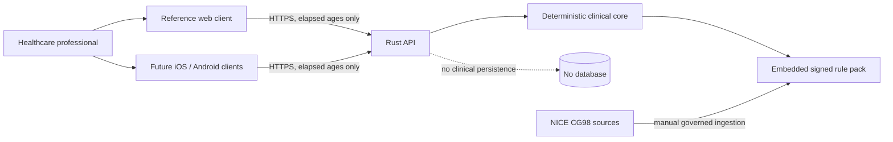
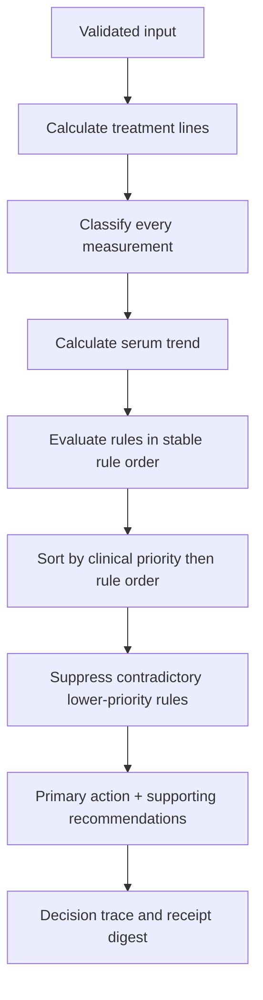

# System architecture

## Context



The system is a stateless decision service. It has no patient repository, message queue, background clinical processing or direct connection to clinical systems.

## Repository architecture

The implementation will use one repository with:

```text
Cargo workspace
├── crates/clinical-core
├── crates/guideline-data
├── apps/api
├── web
├── infrastructure
└── spec
```

### `clinical-core`

Responsibilities:

- domain types and invariants;
- exact rational threshold calculations;
- trend calculations;
- pure rule evaluation;
- priority and conflict resolution;
- normalisation and decision-trace construction; and
- no I/O, clock, network, environment or framework dependencies.

The core accepts a fully validated assessment, rule pack and evaluation context and returns either a complete deterministic result or a typed safety error.

### `guideline-data`

Responsibilities:

- serialised rule-pack schema;
- build-time loading and validation;
- source manifest and hashes;
- immutable embedded approved pack;
- startup self-test vectors; and
- tooling to compare a candidate pack with its predecessor.

The production API MUST NOT retrieve or scrape NICE content during startup or runtime.

### `api`

Responsibilities:

- Axum routes and OpenAPI implementation;
- JSON parsing with duplicate-key and unknown-property rejection;
- request/domain validation;
- rate, body-size, timeout, CORS and security middleware;
- response mapping and legal content;
- readiness self-checks;
- metrics and privacy-safe logging; and
- lifecycle/configuration management.

Use Tokio, Serde, Tower-compatible middleware, rustls, structured tracing and an OpenAPI generator compatible with the committed contract. Dependency versions are pinned in `Cargo.lock`.

### Reference web

The web application is a separately built static React/TypeScript application. It consumes a generated TypeScript client and contains no clinical decision logic.

## Evaluation data flow

```mermaid
sequenceDiagram
    actor C as Clinician
    participant W as Web client
    participant A as API boundary
    participant E as Clinical core
    participant R as Rule pack

    C->>W: Enter birth/assessment times and clinical facts
    W->>W: Derive elapsed minutes; validate form
    W->>A: POST EvaluationRequest
    A->>A: Parse, validate and normalise
    A->>R: Resolve exact active rule-pack ID
    A->>E: Evaluate(normalised input, rule pack)
    E->>E: Thresholds, trends, rules and priorities
    E-->>A: Complete result or typed safety failure
    A->>A: Add receipt, version and notices
    A-->>W: EvaluationResponse; no-store
    A->>A: Drop clinical request/response values
    W-->>C: Present result for clinical review
```

## Exact arithmetic

Thresholds and rates are represented internally as reduced fractions of signed 64-bit integers. Operations use checked multiplication and addition. A failed checked operation is a safety fault: the API returns `503 ENGINE_SAFETY_CHECK_FAILED` and no result.

Formatting occurs only after decisions. A display value can never be parsed back or compared to determine an action.

The clinical core must be pure enough that a test can serialise the same input and rule pack on any supported architecture and receive the same clinical structure and exact relations. Operational metadata such as UUID and evaluation timestamp is added outside the core.

## Rule evaluation



Rule predicates are implemented as typed Rust functions. The YAML describes normative inputs and mappings; v1 does not contain a general-purpose expression interpreter. This prevents unreviewed executable logic from being introduced as data.

## Trust boundaries

| Boundary | Untrusted input | Control |
|---|---|---|
| Internet to WAF/load balancer | Traffic, IP, headers, payload size | Geo restriction, TLS, WAF rules, rate limits, timeouts |
| Load balancer to API | JSON and request metadata | Private network, security groups, schema/domain validation |
| API to clinical core | Normalised typed values | No raw JSON crosses the boundary |
| Build pipeline to rule pack | Source transcription and manifests | Double entry, hashes, review signatures, golden tests |
| API to observability | Operational events | Explicit allowlist; no clinical values or bodies |

## Configuration

Configuration is environment-driven but validated into a typed immutable structure at startup. Required settings include:

- operating mode: `demonstration` or `clinical`;
- active rule-pack ID;
- public base URLs;
- allowed browser origins;
- request and rate limits;
- log level and metrics exporter;
- release-authorisation reference; and
- required legal-document version.

The service MUST refuse readiness when clinical mode is requested without an active approved pack and matching release-authorisation reference.

## Architecture requirements

| ID | Requirement |
|---|---|
| DATA-024 | The clinical core MUST be deterministic and independent of wall clock, network, filesystem and environment. |
| DATA-025 | The HTTP layer MUST convert wire types to domain types before invoking the core. |
| DATA-026 | No raw JSON value or optional map MUST enter clinical rule functions. |
| DATA-027 | Production rule packs MUST be embedded in the release artifact and verified at startup. |
| DATA-028 | The service MUST have no database or server-side patient session. |
| DATA-029 | Background work MUST NOT complete or alter a clinical evaluation after the HTTP response. |
| DATA-030 | Runtime configuration MUST NOT change formulas, thresholds, comparators or rule priorities. |

## Failure model

Failures are classified:

- **client input failure**: `400`, `413` or `422`; no evaluation;
- **rule-pack mismatch**: `409`; client refreshes metadata;
- **capacity or transient dependency failure**: `429` or `503`; client fails closed;
- **safety integrity failure**: readiness false and `503`; operator alert; no result;
- **unexpected code failure**: `500`; generic problem; incident review if clinical mode.

Panics MUST be caught at the request boundary, produce no partial result and increment a high-severity alert. The process SHOULD terminate after an invariant panic so orchestration replaces the instance.

## Native-client path

The first implementation does not build production native apps. Release CI generates Swift and Kotlin clients from `openapi.yaml`. Consumer fixtures must demonstrate:

- metadata fetch;
- request construction;
- exhaustive enum handling;
- `409` refresh flow;
- fail-closed network handling; and
- display of source/version/legal fields.

No Rust FFI, WebAssembly or downloaded-rule execution is included in v1.
