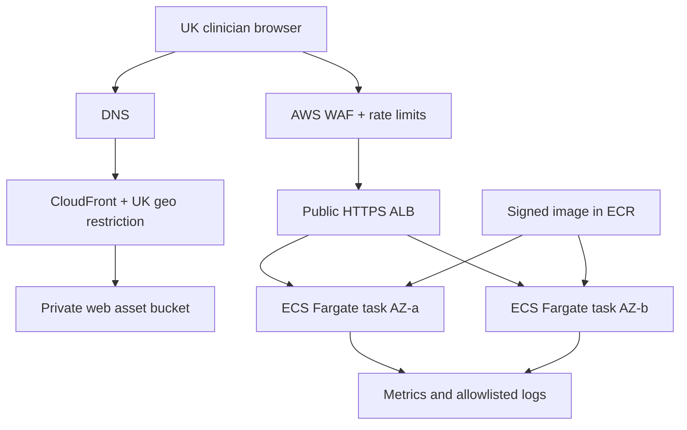

# Deployment and operations

## Deployment model

The service ships as portable OCI images and a reference AWS deployment in `eu-west-2` (London). The container interface remains cloud-independent; the reference infrastructure is the supported pilot topology.

There is no production database, cache, queue or clinical object store.

## Container contract

The API image:

- is built in a multi-stage build from a pinned Rust toolchain;
- contains only the API binary, approved rule packs, CA certificates and required notices;
- runs as an unprivileged fixed UID/GID;
- exposes one HTTP port internally;
- handles SIGTERM, stops accepting work and completes in-flight requests within 10 seconds;
- has a read-only root filesystem and bounded memory-backed `/tmp`;
- contains OCI source/revision/version labels;
- has an SBOM, vulnerability report and signed provenance; and
- starts with readiness false until integrity/self-tests pass.

## AWS resources

- Route 53 records and ACM certificates.
- CloudFront with Origin Access Control for the private S3 web bucket and UK geo restriction.
- WAF on the API path with UK allow policy, managed baseline rules, size limits and rate rules.
- Internet-facing ALB terminating TLS; HTTP listener redirects safe GETs and rejects clinical POST through WAF/API policy.
- ECS Fargate service spanning two private subnets/AZs, minimum two tasks.
- ECR repository with immutable tags and scan-on-push.
- CloudWatch metrics, allowlisted structured logs, dashboards and alarms.
- Secrets Manager/Parameter Store for operational configuration; no clinical secrets are expected.
- Terraform remote state with encryption, locking and restricted operator roles.

Static web assets may be served at the edge but NICE-derived content and access remain UK-restricted.

## Environments

| Environment | Data | Rule-pack status | Access/use |
|---|---|---|---|
| Local | Synthetic only | Draft | Developer machine |
| CI | Generated synthetic/property cases | Draft/candidate | Ephemeral |
| Test | Synthetic only | Candidate | Engineering |
| Clinical validation | Approved synthetic scenarios | Clinically validated | Named reviewers |
| Shadow pilot | Live transient input, output not used in care | Active release candidate | Pilot organisation |
| Advisory pilot | Live transient input | Active | Authorised professional use after all gates |
| Production | Future; separate approval | Active | Not implied by pilot completion |

No patient-derived request may be replayed into a lower environment.

## Availability and scaling

| ID | Requirement |
|---|---|
| OPS-001 | Pilot API MUST run at least two healthy tasks across separate availability zones. |
| OPS-002 | Autoscaling SHOULD target CPU and request count while preserving a minimum of two tasks. |
| OPS-003 | Readiness failures MUST remove an instance from service immediately. |
| OPS-004 | A deployment MUST not become ready until rule-pack and release-authorisation self-checks pass. |
| OPS-005 | The pilot target is 99.9% monthly availability excluding approved maintenance. |
| OPS-006 | Clients MUST remain fail closed; infrastructure availability does not justify cached clinical output. |

## Observability

Allowed log fields:

- timestamp;
- level;
- service/release/engine/rule-pack versions;
- route template, HTTP method and status;
- request ID;
- duration and response size;
- coarse failure category; and
- instance/deployment identity.

Prohibited fields include source IP at application layer, request/response bodies, measurement counts where linked to request ID, gestation, ages, values, clinical flags, recommendation codes, receipt digest and user-agent strings unless a reviewed security need exists.

Metrics:

- request rate, duration and status by route;
- readiness/liveness;
- instance resource use;
- rule-pack integrity check result;
- WAF allowed/blocked counts;
- deployment and rollback status; and
- error/panic count without clinical labels.

Alarms:

| Condition | Severity/action |
|---|---|
| No ready tasks or readiness integrity failure | Critical; page operator and clinical-safety contact |
| Any invariant panic | Critical; remove task, assess release |
| 5xx >1% for 5 minutes | High; investigate and consider rollback |
| p95 >250 ms for 10 minutes | Medium; capacity investigation |
| Rule-pack/source monitor detects change | Clinical alert; review within one working day |
| WAF block/rate anomaly | Security alert |
| Certificate or domain expiry window | Operational alert at 30/14/7 days |

## Deployment process

1. CI builds and tests the exact commit.
2. Generate SBOM, provenance, image digest, engine version and rule-pack digest.
3. Verify all required review/release artefacts.
4. Sign image and release manifest.
5. Terraform plan is reviewed by a second operator.
6. Deploy one canary task with no production traffic; pass startup and smoke tests.
7. Route 5% traffic to canary for at least 30 minutes while monitoring non-clinical metrics.
8. Increase to 50%, then 100%, with an explicit approval at each stage.
9. Retain the previous image and rule pack as the immediate rollback target.
10. Record completion in the release log.

Clinical outputs cannot be safely compared in production telemetry because inputs are not logged. Release correctness is established before deployment through deterministic golden tests.

## Rollback

Rollback is triggered by:

- clinical discrepancy or integrity concern;
- safety or security incident;
- readiness/panic regression;
- sustained severe error/latency regression; or
- failed source/release manifest verification.

Rollback changes both image and embedded rule pack to the last jointly authorised release. Mixing a prior engine with a newer rule pack is prohibited unless that combination has its own release authorisation.

Target: begin rollback within 15 minutes of a critical decision and restore the last authorised version within 30 minutes. If integrity remains uncertain, disable clinical mode and serve a clear unavailable response.

## Backup and recovery

No patient database exists. Backups cover:

- Git repository and protected release tags;
- source and rule-pack manifests;
- signed images and SBOM/provenance;
- Terraform state;
- clinical-safety and regulatory artefacts; and
- release and incident records.

Recovery exercises occur before pilot and at least annually. The service can be reconstructed from signed artifacts and infrastructure code without clinical request data.

## Operations requirements

| ID | Requirement |
|---|---|
| OPS-007 | Production infrastructure changes MUST be reviewed and applied through version-controlled Terraform. |
| OPS-008 | Image tags MUST be immutable; deployments MUST reference image digests. |
| OPS-009 | Application logs MUST expire after 30 days and metrics after 13 months unless policy sets a shorter period. |
| OPS-010 | The operator MUST maintain a tested clinical downtime procedure and publish service status. |
| OPS-011 | Clinical mode MUST be switchable off without deploying new clinical code. |
| OPS-012 | The switch to demonstration/unavailable mode MUST not expose a draft rule pack as clinically usable. |
| OPS-013 | Quarterly access review is required for cloud, artifact, log and infrastructure-state privileges. |
| OPS-014 | Operator runbooks MUST cover outage, rule-pack integrity, suspected incorrect result, data leakage, certificate failure, WAF abuse and rollback. |

## Self-hosting

The OCI image may be deployed by a UK healthcare organisation if it preserves:

- HTTPS and UK-only use;
- two-instance resilience or an approved local alternative;
- immutable approved image/rule-pack pairing;
- request/log privacy controls;
- release-authorisation startup checks;
- monitoring, incident and rollback responsibilities; and
- local DCB0160 approval.

Self-hosting does not transfer or remove manufacturer DCB0129, medical-device or NICE-licensing obligations.
